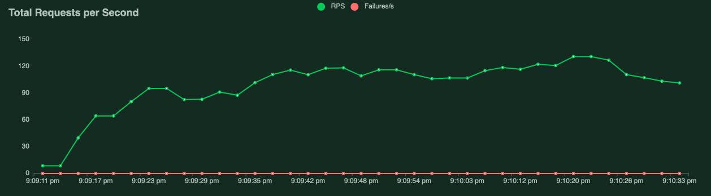

# Clipboard Health Challenge

## Overview

### Infra

- The project is built using typescript, express, prisma, postgres
- Testing: Using jest
- Logger: Using winston and morgan
- Error handling: Using centralized error handling mechanism
- API docs: with swagger-jsdoc and swagger-ui-express
- Dependency managed using Yarn
- Environment variables: Using dotenv and cross-env
- Santizing support: Sanitize request data against xss and query injection
- Docker support: Dev, Test and Production docker support
- Linting: Using ESLint and Prettier

### Features

- The server exposes a single endpoint `/v1/worker/:worker_id` to get all available shifts as per the
  requirements specified in the problem statement

## Setup

- Intialize the db with dummy data by executing:

```
$ cd seed
$ docker-compose up -d --build
```

- Install dependencies in root repo:

```
$ yarn install
```

# Environment Variables

- Env file template is provided for reference `.env.example`
- Need to set the appropriate `DATABASE_URL`

## Start the server

- Start server by executing following command in root repo:

In development:

```
$ yarn dev
```

In production:

```
$ yarn dev
```

This will start development server

- One can interact with the server by visiting `http://localhost:3000/v1/worker/101`
  This will return the available shifts for the worker with id 101 for e.g.

- One can start the server using docker too

- View swagger docs by vising `http://localhost:3000/v1/docs/#/`

## Run tests

- Make sure the dummy db docker container is stopped, if not follow the following commands:

```
$ docker stop container_id
$ docker rm container_id
```

- The tests covered success and fail cases for workers when trying to query available shifts

- Start tests:

```
$ yarn test
```

- Run all tests in watch mode

yarn test:watch

## Performance Testing

- We will use locust to monitor RPS performance for our single endpoint
- Used for performance (load and stress) testing the API

### Setup

- Setup virtual env

```
$ python3 -m venv venv
$ pip3 install -r requirements.txt
```

- Initialise environment

```
$ source venv/bin/activate

```

### Run performance test

- Execute:

```
$ ./deploy
```

- Open web interface url from console output. The locust server is available at `http://0.0.0.0:8089`

- Paste our server endpoint i.e `http://localhost:3000` in the `Host` field

- Performance Report
  

- As we can see for 20 simulataneous users, the max RPS we are getting is ~120

## Further Performance Improvement

- Since `Shift` table has ~2M rows, the performance suffers when we are querying the same
- We can speed up already served up queries/workers by using in-memory cache layer such as `redis`
- Using secondary/slave read-only server for reads, since we are only reading the data
- Depending on how many shifts per facility is available, perhaps it's worthwhile partioning the data using facility_id/profession
- Creating indexes on relevant tables
  For e.g. since we are querying `Shift` table with the eligible facility_id, profession of a worker, whether worked_id exists, is_deleted or not, perhaps it's worth trying creating indexes for `profession`,`facility_id`, `is_deleted`, `worked_id`
- Horizontal scaling: Docker swarm/kubernetes
  We can create multiple server nodes using docker swarm/kubernetes to distribute the load
